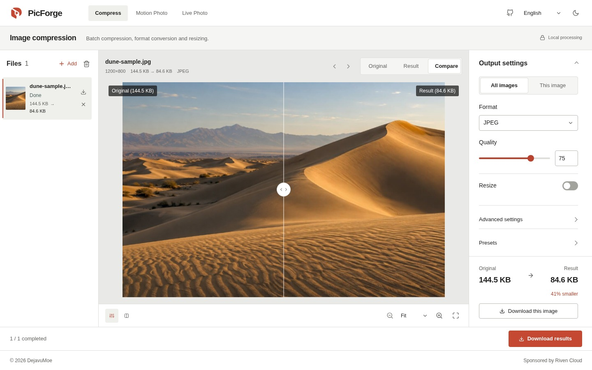
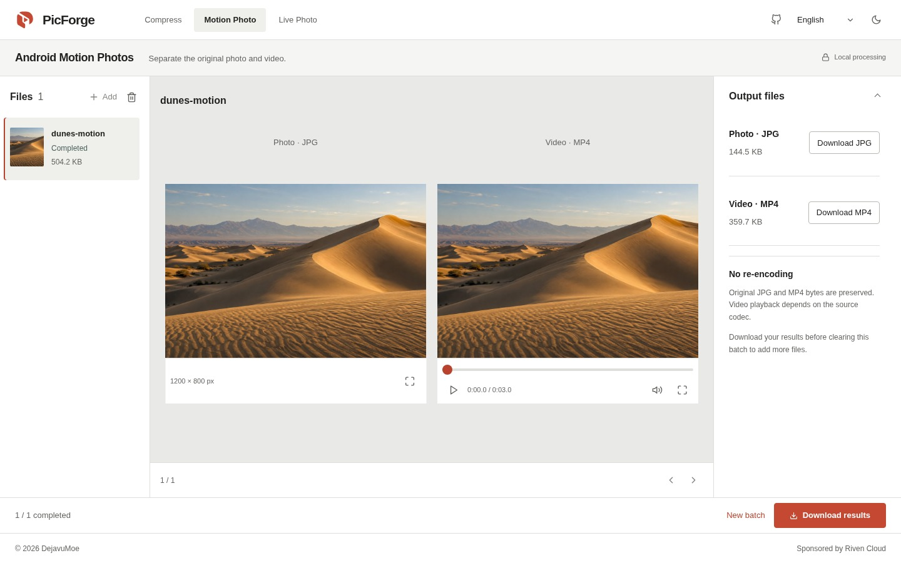
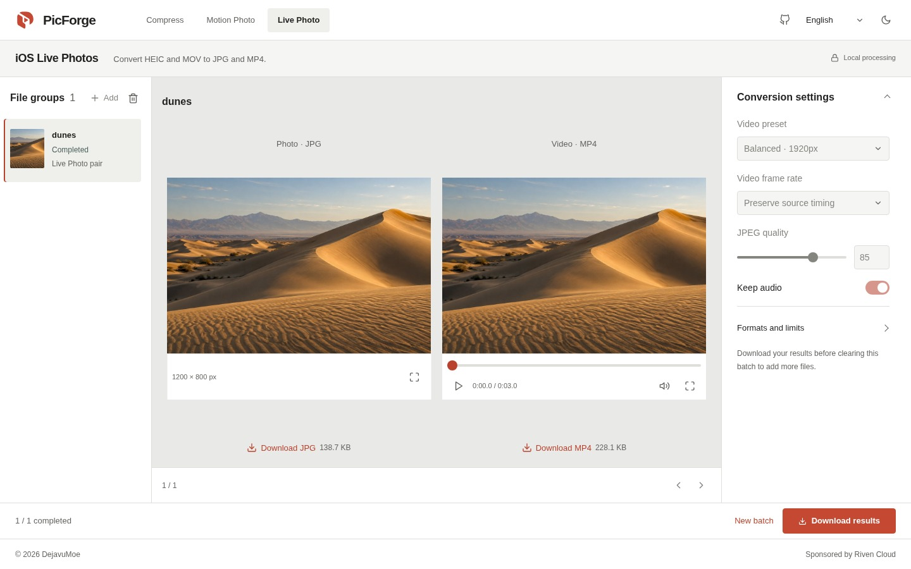

# PicForge

Compress images, split Android Motion Photos, and convert iOS Live Photos. An open-source toolbox that runs in your browser and keeps your files on your device.

[Open PicForge](https://picforge.de) · **English** · [简体中文](docs/readme/README.zh-CN.md) · [繁體中文](docs/readme/README.zh-TW.md) · [日本語](docs/readme/README.ja.md) · [한국어](docs/readme/README.ko.md)



*The current interface, processing the project's generated dune sample. Sizes shown are actual results for this image, not a compression benchmark.*

## Three tools

| Tool | What it does | Export |
| --- | --- | --- |
| **Image compression** | Batch compression, format conversion and resizing. Accepts JPEG, PNG, WebP, AVIF, GIF, BMP and SVG, subject to browser decoding support. | JPEG, WebP, PNG or AVIF |
| **Android Motion Photos** | Splits a JPG containing an appended video into its original photo and video, without re-encoding. | Original JPG + MP4 |
| **iOS Live Photos** | Pairs HEIC/HEIF and MOV by filename and converts them for sharing. Individual photos or videos also work; JPEG and MP4 inputs are accepted too. | JPEG + H.264 MP4, with optional AAC audio |

### Image compression

Drop in images, paste from the clipboard, or open the sample from the home page. Processing starts automatically when you add files or change settings.

- Compare the original and result with a slider or side by side; zoom in or open fullscreen to check details.
- Apply settings to all images, or give one image its own settings. Later global edits leave those custom settings alone.
- Resize by pixels or percentage. Fit keeps proportions without enlarging; center crop fills the frame; stretch uses the exact width and height.
- PNG output is lossless. Its compression does not use the quality slider.

### Motion Photos and Live Photos

Add originals, check the queue, then start the batch. Jobs run one at a time, with cancellation and retry. Preview photos and videos together, download them separately, or save completed results as a ZIP with a manifest.

Android extraction keeps the original bytes. iOS conversion handles display crop and rotation, preserves source video timing by default, and offers a 30 fps option.

<details>
<summary>View both media tools</summary>

**Android Motion Photos**



**iOS Live Photos**



The media examples are synthesized from the same generated dune image. These are real extraction and conversion results, not camera compatibility tests. [Image provenance](docs/assets/readme/README.md).

</details>

## How files are processed

Everything runs locally. No account, media upload, processing server or API key is needed. PicForge has no telemetry; the browser downloads the app and the engines it needs.

| Path | Processing |
| --- | --- |
| Images | Browser decoding and Canvas resizing, then a Web Worker encodes with `@jsquash/*`. |
| Android | Validate the embedded MP4 structure, then split the original file into JPG and MP4 byte ranges. |
| iOS | Group matching filenames. libheif decodes HEIC and MozJPEG encodes JPEG; FFmpeg converts video to H.264/AAC MP4. |

Results stay in browser memory until you download them. Switching tools, returning home and using Back/Forward keep your queues. **Reloading or closing the page clears files and results.**

## Before you start

- **Live Photo pairing uses filenames**, not Apple's asset identifiers. Keep the originals: JPEG/MP4 exports do not preserve HEIC's HDR, metadata or auxiliary images as an archive.
- **Browser support varies.** Image decoding and video preview depend on the browser and codec. An extracted video can still be downloaded if it cannot play in the preview. Large files may hit memory or size limits.
- **Offline use needs a first load.** The app can work from its cache; conversion engines must also have loaded and cached successfully. Your first conversion may need a connection.

The interface supports English, Simplified Chinese, Traditional Chinese, Japanese and Korean, with light and dark themes. Language and theme follow your browser/system until you choose otherwise.

## Run locally

Requires **Node.js ≥22.12.0** and **pnpm 11.8.x**.

```sh
git clone https://github.com/DejavuMoe/PicForge.git
cd PicForge
pnpm install
pnpm dev
```

Open [127.0.0.1:5173](http://127.0.0.1:5173). Use `pnpm build` to build and `pnpm preview` to preview. Dev/build prepare the self-hosted codecs under `/wasm/`; the build also generates the service worker's asset list.

## Under the hood

| Part | Stack |
| --- | --- |
| Interface | React 19, TypeScript, Vite 8, plain CSS |
| State and translation | Zustand, i18next |
| Media | Canvas, Web Workers, WebAssembly, `@jsquash/*`, libheif, FFmpeg |
| Downloads and offline use | JSZip, Service Worker |

`packages/app` contains the interface and media tools, `packages/worker` the image pipeline and workers, and `packages/codecs` the encoder adapters and settings. Production compression uses the **Compat** engine; wasm-vips remains experimental.

For changes, run:

```sh
pnpm lint
pnpm typecheck
pnpm test
pnpm build
```

See the [QA checklist](docs/QA_CHECKLIST.md) for browser and media checks, [UI design](docs/UI_DESIGN.md) for the current interface, and [next steps](docs/next-steps-plan.md) for planned work. [Camera validation](docs/SAMPLE_VALIDATION.md) and [engine validation](docs/phase4-validation.md) record their test environments; Playwright WebKit results do not establish real Safari or iPhone support.

Bug reports and patches are welcome. Include the browser, reproduction steps and relevant format/settings. Please keep private photos out of issues and commits; a non-personal reproducer is best.

## License

App code is [MIT](LICENSE). Media components have their own licenses, including [GPL FFmpeg](packages/app/public/licenses/FFmpeg-GPL-2.0.txt) and [LGPL libheif](packages/app/public/licenses/libheif-LGPL-3.0.txt). See [NOTICE.txt](packages/app/public/licenses/NOTICE.txt) for component credits, including MotionFlow.

If you distribute codec binaries, you must also meet their corresponding-source obligations. The app's MIT license does not replace those licenses.
