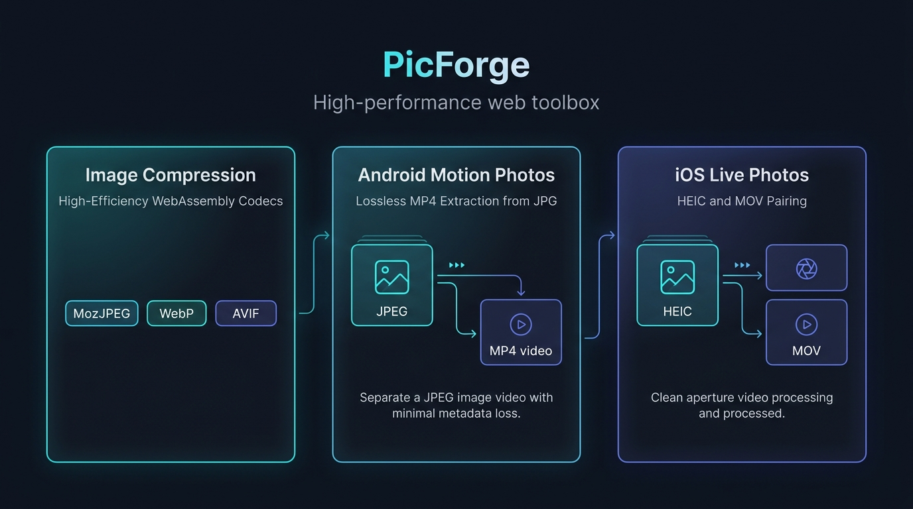

<h1 align="center">PicForge</h1>

<p align="center">
  <strong>WebAssembly駆動のブラウザ完結型・高性能画像＆動的メディア処理ツールキット</strong><br>
  100% クライアントサイド処理 · サーバー送信なし · テレメトリなし · バックエンド不要
</p>

<p align="center">
  <a href="https://picforge.de"><strong>ライブデモ: picforge.de</strong></a>
</p>

<p align="center">
  <strong>言語 / Language:</strong> <a href="../../README.md">English</a> | <a href="README.zh-CN.md">简体中文</a> | <a href="README.zh-TW.md">繁體中文</a> | 日本語 | <a href="README.ko.md">한국어</a>
</p>

<p align="center">
  
  
  
  
  
  
  
</p>

---

## 概要

**PicForge** は、高スループットな画像一括圧縮、Androidモーションフォトの抽出、およびクロスプラットフォーム対応のiOS Live Photos変換に特化したローカルファースト（Local-first）のオープンソースブラウザツールボックスである。

クラウドベースの従来型コンバーターとは異なり、PicForgeのデコード・画像処理・エンコード処理はすべてクライアントサイドのWeb WorkerおよびWebAssembly環境内で完結する。写真や動画のデータが端末の外部へ送信されることは一切ない。

<p align="center">
  
</p>

---

## コア機能

### ⚡ 1. 画像の一括圧縮
* **WebAssemblyコーデック群**: `@jsquash/*` でコンパイルされた各種WASMネイティブコーデックを統合:
  * **MozJPEG**: 視覚的量子化とプログレッシブスキャンによる高効率圧縮。
  * **WebP**: 可逆（Lossless）および非可逆（Lossy）に対応し、SIMDアクセラレーションを自動検出。
  * **OxiPNG**: 可逆マルチパスPNG最適化。
  * **AVIF**: 0–100の線形品質マッピングおよび彩度サブサンプリング制御（`4:4:4` vs `4:2:0`）に対応した次世代フォーマット。
* **柔軟なリサイズ処理**: アスペクト比を維持する3種類のリサイズ方式:
  * `contain`: 拡大を行わず、指定境界内に収まるよう縮小。
  * `cover`: 中央基準でクロップし、目標寸法を正確に充填。
  * `stretch`: アスペクト比を固定せず、指定された絶対サイズに変形。
* **階層的設定モデル**: 全体への一括適用プリセットに加え、キュー内の特定画像に対して独立した完全設定スナップショットを適用可能（全体設定を変更しても個別スナップショットは保持される）。
* **リアルタイム画質比較**:
  * ビューポートレイヤークリップ方式による高精度な分割比較スライダー。
  * 並列表示（Side-by-side）および単一画像表示、2倍ズームとキャンバスドラッグによる細部検証。
* **並行性制御と堅牢性**:
  * 上限付きWeb Workerプールによるスケジューリング。
  * `AbortController` および `taskEpoch` シーケンス番号によるキャンセル保護（完了した古いWorkerの遅延コールバックによるStore汚染を防止）。
  * ディレクトリトラバーサル防止処理済みのZIP一括エクスポートと、設定情報を記録したメタデータ（`picforge-manifest.json`）の同梱。

### 📱 2. Android モーションフォトの抽出
* **バイナリ解析エンジン**: JPEGのバイナリ構造を走査し、内部に埋め込まれたMP4マイクロ動画ストリームのオフセットを直接特定。
* **完全ロスレス・バイト一致**: 再デコードや再エンコードを一切行わず、元の静止画JPEGと埋め込みMP4を直接分離。出力バイト列は元のデータと完全に一致。
* **高スループット**: 重いエンコード処理を介さないため、端末のディスクおよびメモリI/O速度で瞬時に処理が完了。
* **バッチ抽出**: 複数ファイルの一括ドラッグ＆ドロップ、進捗表示、ZIPアーカイブ出力に対応。

### 🍏 3. iOS Live Photos（実況写真）の変換
* **ヒューリスティックなベース名ペアリング**: 大小文字を区別しないディレクトリ構造とファイルベース名（Basename）に基づき、混在する `.HEIC` 写真と `.MOV` 動画を自動マッチング。
* **QuickTime Clean Aperture（`clap`）アダプター**: QuickTime Atom構造の有効開口情報を解析し、自動回転後のクロップ範囲を事前に補正。エッジの黒帯や不要なラスタ境界の発生を排除。
* **クライアントサイド変換パイプライン**:
  * **HEIC → MozJPEG**: `libheif-js` を用いてブラウザ内でHEIFを直接デコードし、高品質JPEGへ変換。
  * **MOV → H.264 / AAC**: 単一スレッドWASM版FFmpegを用いて、広範な互換性を持つ標準Web MP4形式へトランスコード。
* **フレーム精度のPTS維持**: 表示タイムスタンプ（PTS）を標準で厳密に維持し、フレームレート再サンプリングによるフレーム重複やカクつきを防止（明示的な30 fpsリサンプリングも選択可能）。
* **トランスコードプリセット**:
  * **Balanced（標準）**: CRF 23、長辺 ≤ 1920px、MozJPEG品質85（推奨デフォルト）。
  * **Quality（高画質）**: CRF 20、長辺 ≤ 1920px、MozJPEG品質90。
  * **Compact（高圧縮）**: CRF 26、長辺 ≤ 1280px、MozJPEG品質75。
* **非対応環境でのフォールバック**: ブラウザが特定の動画コーデックのインライン再生をサポートしていない場合、静止画プレビューと案内メッセージを表示し、ダウンロード機能はそのまま維持。

---

## アーキテクチャとプライバシー設計

* **100% ローカル処理とゼロトラストプライバシー**: テレメトリ、行動トラッキング、Cookie、外部サーバーへのアップロードは一切行わない。すべての処理は現在のブラウザタブのメモリ内でのみ実行される。
* **WASMエンジンの遅延ロード（Lazy Loading）**: FFmpegやlibheifなどの容量の大きいWASMエンジンは、対応するワークスペースにアクセスした初回にのみオンデマンドでロードされる。
* **PWAオフライン対応**: ビルド時に静的資産リスト（`precache.json`）を生成するService Workerを内蔵。初回読み込み後は、完全なオフライン環境でも起動および動作が可能。
* **メモリライフサイクルの管理**: 生成されたObject URLおよびバイナリArrayBufferを明示的に解放し、大規模なバッチ処理時におけるタブのクラッシュを防ぐ。
* **5言語の多言語対応（i18n）**: `i18next` による完全ローカライズ:
  * 英語 (`en`)
  * 簡体字中国語 (`zh-CN`)
  * 繁体字中国語 (`zh-TW`)
  * 日本語 (`ja`)
  * 韓国語 (`ko`)
* **モダンな適応型UI**: CSS変数と設計トークンによるグラスモーフィズムデザイン、Geistフォント、Canvasパーティクル背景、完了時のコンフェッティ演出、ライト/ダークテーマ切り替えを完備。

---

## ベンチマークと実測結果

公式の受け入れテスト用サンプル（Chromium / Linux x86_64環境）における実測トランスコードデータ:

| メディア種別 | 入力ソース | 出力ファイル | 出力解像度 | サイズ削減率 | 構造類似性 (SSIM) |
| :--- | :--- | :--- | :--- | :---: | :---: |
| **iOS 写真** | 2.33 MB HEIC | 2.01 MB MozJPEG (Q85) | 4284 × 5712 | **-13.8%** | **0.9898** |
| **iOS 動画** | 2.89 MB MOV | 0.94 MB H.264 MP4 | 1308 × 1744 | **-67.4%** | **0.9821** |
| **Android 写真** | 9.35 MB JPG | バイト一致の JPG + MP4 | 原寸維持 | ロスレス | **1.0000** |

*詳細なPTSタイミング解析、SSIM算出手法、ブラウザ別の動作検証については [docs/SAMPLE_VALIDATION.md](../SAMPLE_VALIDATION.md) を参照。*

---

## Monorepo 構成

PicForgeは、`pnpm` で管理されるモジュール構成のTypeScript Monorepoである:

```text
PicForge/
├── docs/                       # QAチェックリスト、検証レポート、多言語ドキュメント
├── packages/
│   ├── app/                    # React 18 + Vite クライアント、Zustandストア、UIワークスペース
│   │   ├── public/             # PWA Manifest、Service Worker、フォント、WASMバイナリ
│   │   └── src/
│   │       ├── components/     # UIコンポーネント（DropZone、Preview、FileList、Settings等）
│   │       ├── hooks/          # autoCompressController および Workerプール制御
│   │       ├── landing/        # Canvasパーティクル背景と製品ランディングページ
│   │       ├── motion/         # Clean-apertureパーサー、HEIC/FFmpegパイプライン、MotionWorkspace
│   │       └── stores/         # Zustand状態管理（fileStore、settingsStore）
│   ├── codecs/                 # 各種コーデック定義、設定スキーマ、WASMローダー
│   └── worker/                 # Web Workerプール、デコード/リサイズ、AVIF/WebPエンコーダー
├── sample/                     # AndroidおよびiOSの公式検証用サンプル（改変不可）
└── scripts/                    # コーデック準備スクリプト、Playwrightブラウザテスト、デプロイツール
```

---

## クイックスタート

### 前提環境
* **Node.js**: `^20.11.0` または `^22.0.0`（LTS推奨）
* **pnpm**: `^11.8.0`

### インストールと開発

```bash
# リポジトリのクローン
git clone https://github.com/DejavuMoe/PicForge.git
cd PicForge

# 依存パッケージのインストール
pnpm install

# 開発サーバーの起動（127.0.0.1:5173でリッスン）
pnpm dev
```

### プロダクションビルド

```bash
# アプリケーションのビルドおよびWASMエンジンの配置
pnpm build

# ビルド成果物のローカルプレビュー
pnpm preview
```

---

## 品質保証とテスト

PRの提出やリリースの前に、以下の検証コマンドを実行すること:

```bash
# コード規約チェック
pnpm lint

# ワークスペース全体の静的型チェック
pnpm typecheck

# 単体テストおよびWASM統合テスト（128件すべて通過）
pnpm test

# 実サンプルによるブラウザ統合テスト（Chromiumおよびffprobeが必要）
pnpm exec playwright install chromium
pnpm test:browser
```

---

## ブラウザ互換性

| ブラウザエンジン | デスクトップ | モバイル | 検証状態 | 備考 |
| :--- | :---: | :---: | :---: | :--- |
| **Chromium** (Chrome, Edge, Brave) | ✅ | ✅ | **検証済み** | ネイティブH.264再生、完全なPWAオフライン、WASM SIMDアクセラレーション対応。 |
| **Gecko** (Firefox) | ✅ | ✅ | **対応** | 圧縮、抽出、ダウンロードに完全対応。一部再生環境で静止画フォールバックを提供。 |
| **WebKit** (Safari, iOS Safari) | ✅ | ✅ | **対応** | 標準的なWeb WorkerとWebAssembly仕様に準拠し、`SharedArrayBuffer` は不要。 |

---

## オープンソースライセンスと法令遵守

* **アプリケーションコード**: [MIT License](../../LICENSE) の下で公開。
* **サードパーティコーデックおよびバイナリ**:
  * **FFmpeg WebAssembly Core**: [GPL-2.0-or-later](../../packages/app/public/licenses/FFmpeg-GPL-2.0.txt) ライセンス。
  * **libheif**: [LGPL-3.0](../../packages/app/public/licenses/libheif-LGPL-3.0.txt) ライセンス。
  * **MotionFlow**: 抽出ロジックは [MIT License](../../packages/app/public/licenses/MotionFlow-MIT.txt) の下で統合。
* 詳細なサードパーティライセンス通知については [NOTICE.txt](../../packages/app/public/licenses/NOTICE.txt) を参照。
