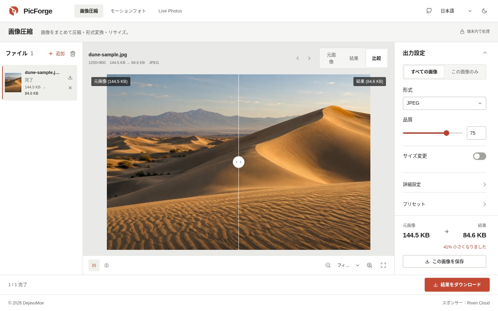
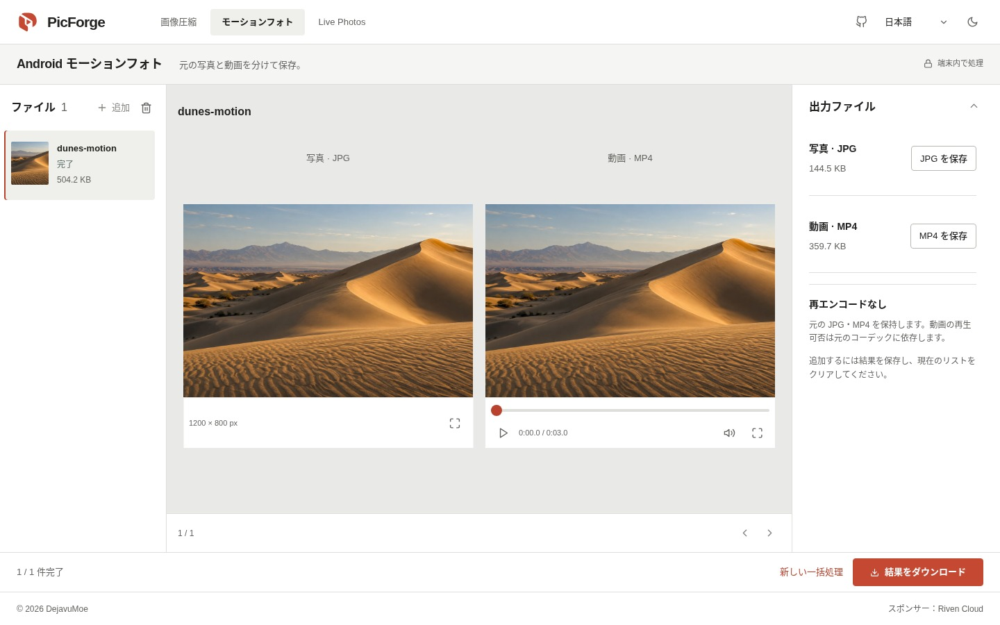
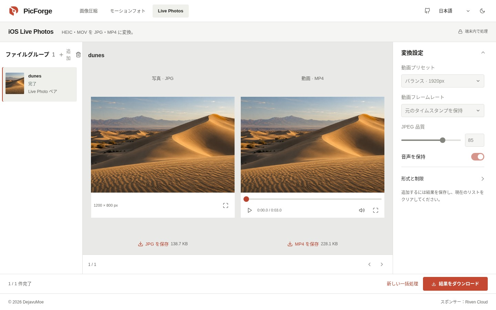

# PicForge

画像の圧縮、Android Motion Photo の分離、iOS Live Photos の変換をブラウザーで。ファイルを端末の外に送らずに使える、オープンソースの画像ツールです。

[PicForge を開く](https://picforge.de) · [English](../../README.md) · [简体中文](README.zh-CN.md) · [繁體中文](README.zh-TW.md) · **日本語** · [한국어](README.ko.md)



*現在の画面で、プロジェクト付属の生成された砂丘画像を処理したものです。表示サイズはこの画像の実際の結果であり、一般的な圧縮性能を示す数値ではありません。*

## 3つのツール

| ツール | できること | 出力 |
| --- | --- | --- |
| **画像圧縮** | まとめて圧縮、形式変換、リサイズ。JPEG、PNG、WebP、AVIF、GIF、BMP、SVG を入力可能。ブラウザーのデコード対応が必要です。 | JPEG、WebP、PNG、AVIF |
| **Android Motion Photos** | 動画が末尾に付いた JPG を、元の写真と動画に分離。再エンコードは行いません。 | 元の JPG + MP4 |
| **iOS Live Photos** | HEIC/HEIF と MOV をファイル名でペアにし、共有しやすい形式へ変換。写真・動画の単独処理や、JPEG・MP4 の入力も可能。 | JPEG + H.264 MP4。音声は必要に応じて AAC で保存 |

### 画像圧縮

画像をドロップするか、クリップボードから貼り付けてください。ホーム画面のサンプルでも試せます。ファイルの追加や設定の変更に合わせて、自動で処理します。

- スライダーや左右に並べた表示で比較し、拡大・全画面表示で細部を確認できます。
- 全画像に共通の設定と、画像ごとの設定を使い分けられます。共通設定を変更しても、個別設定は上書きされません。
- ピクセル数または割合でリサイズ。枠内に収める場合は縦横比を保ち、拡大しません。中央クロップは指定サイズを埋め、引き伸ばしは指定した幅と高さに合わせます。
- PNG 出力は可逆圧縮です。品質スライダーは使いません。

### Motion Photos と Live Photos

元ファイルを追加し、一覧を確認してから一括処理を開始します。処理は1件ずつ進み、キャンセルと再試行ができます。写真と動画を並べて確認し、個別にダウンロードするか、完了した結果を一覧情報付きの ZIP にまとめられます。

Android の分離では元のバイト列を保持します。iOS の変換では表示領域のクロップと回転を処理し、既定で動画の元のタイムスタンプを維持します。固定 30 fps も選べます。

<details>
<summary>写真・動画ツールの画面を見る</summary>

**Android Motion Photos**



**iOS Live Photos**



デモ用ファイルは同じ砂丘の生成画像から合成しています。実際の分離・変換結果ですが、カメラの互換性テストではありません。[画像の出典](../assets/readme/README.md)。

</details>

## 処理の流れ

処理はすべて端末内で完結します。アカウント、メディアのアップロード、処理サーバー、API キーは不要です。PicForge はテレメトリーを送信せず、ブラウザーはアプリと必要なエンジンをダウンロードします。

| 対象 | 処理 |
| --- | --- |
| 画像 | ブラウザーでデコードし、Canvas でリサイズ。Web Worker 内の `@jsquash/*` でエンコード。 |
| Android | 埋め込み MP4 の構造を検証し、元ファイルを JPG と MP4 のバイト範囲に分離。 |
| iOS | 同名ファイルをグループ化。libheif で HEIC をデコードし、MozJPEG で JPEG に変換。動画は FFmpeg で H.264/AAC MP4 に変換。 |

結果はダウンロードするまでブラウザーのメモリーに保存されます。ツールの切り替え、ホームへの移動、ブラウザーの戻る・進む操作では一覧を維持します。**ページの再読み込みや終了でファイルと結果は消えるため、先にダウンロードしてください。**

## 使う前に

- **Live Photos のペア判定はファイル名に基づきます。** Apple のアセット識別子は検証しません。JPEG/MP4 は HEIC の HDR、メタデータ、補助画像を保管する形式ではないため、元ファイルを残してください。
- **対応状況はブラウザーによって異なります。** 画像のデコードや動画プレビューはブラウザーとコーデックに依存します。分離した動画が再生できなくても、ダウンロードは可能です。大きなファイルはメモリーやサイズの制限に達する場合があります。
- **オフライン利用には事前の読み込みが必要です。** アプリはキャッシュから動作しますが、変換エンジンも読み込みとキャッシュが済んでいる必要があります。初回の変換には通信が必要な場合があります。

英語、簡体字中国語、繁体字中国語、日本語、韓国語と、ライト・ダークテーマに対応。手動で選ぶまでは、言語はブラウザー、テーマはシステムの設定に従います。

## ローカルで動かす

**Node.js ≥22.12.0** と **pnpm 11.8.x** が必要です。

```sh
git clone https://github.com/DejavuMoe/PicForge.git
cd PicForge
pnpm install
pnpm dev
```

[127.0.0.1:5173](http://127.0.0.1:5173) を開きます。`pnpm build` でビルド、`pnpm preview` でプレビューできます。開発・ビルド時に、アプリ自身が配信するコーデックを `/wasm/` に準備します。ビルド時には Service Worker 用のアセット一覧も生成します。

## 技術構成と開発

| 部分 | 使用技術 |
| --- | --- |
| UI | React 19、TypeScript、Vite 8、通常の CSS |
| 状態管理・翻訳 | Zustand、i18next |
| メディア処理 | Canvas、Web Workers、WebAssembly、`@jsquash/*`、libheif、FFmpeg |
| ダウンロード・オフライン | JSZip、Service Worker |

`packages/app` に UI と写真・動画ツール、`packages/worker` に画像処理と Worker、`packages/codecs` にエンコーダーのアダプターと設定があります。本番の画像圧縮には **Compat** エンジンを使用し、wasm-vips は実験段階です。

変更後は次を実行してください。

```sh
pnpm lint
pnpm typecheck
pnpm test
pnpm build
```

ブラウザー・メディアの検証は [QA チェックリスト](../QA_CHECKLIST.md)、現在の UI は [UI 設計](../UI_DESIGN.md)、今後の作業は[開発計画](../next-steps-plan.md)を参照してください。[カメラサンプルの検証](../SAMPLE_VALIDATION.md)と[エンジンの検証](../phase4-validation.md)にはテスト環境を記録しています。Playwright WebKit の成功は、実際の Safari や iPhone での動作確認を意味しません。

不具合報告やパッチを歓迎します。ブラウザー、再現手順、ファイル形式、関連する設定を添えてください。Issue やコミットに私的な写真を含めず、個人情報を含まないサンプルで再現できると助かります。

## ライセンス

アプリのコードは [MIT](../../LICENSE) です。メディア関連のコンポーネントには、[GPL の FFmpeg](../../packages/app/public/licenses/FFmpeg-GPL-2.0.txt) や [LGPL の libheif](../../packages/app/public/licenses/libheif-LGPL-3.0.txt) など、それぞれのライセンスが適用されます。MotionFlow を含むクレジットは [NOTICE.txt](../../packages/app/public/licenses/NOTICE.txt) に記載しています。

コーデックのバイナリーを配布する場合、対応するソースコードの提供義務も満たす必要があります。アプリの MIT ライセンスが、各コンポーネントのライセンスに置き換わるわけではありません。
