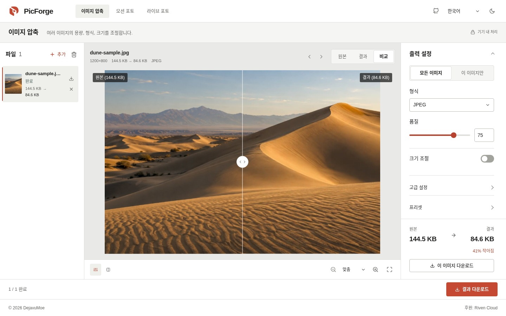
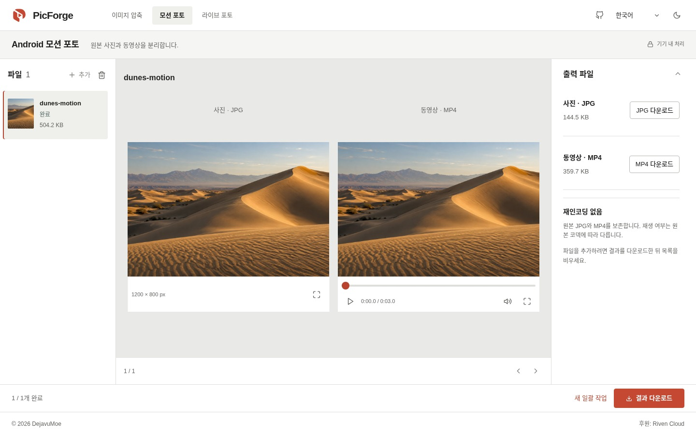
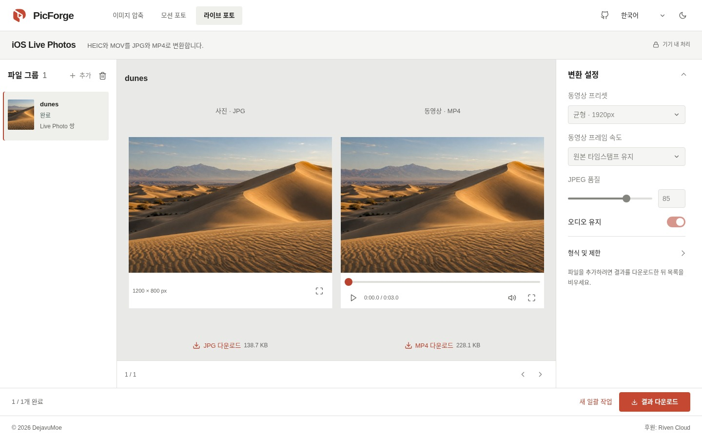

# PicForge

이미지를 압축하고, Android 모션 포토를 분리하고, iOS Live Photo를 변환하세요. 브라우저에서 실행되는 오픈 소스 도구로, 파일은 내 기기에 그대로 남습니다.

[PicForge 열기](https://picforge.de) · [English](../../README.md) · [简体中文](README.zh-CN.md) · [繁體中文](README.zh-TW.md) · [日本語](README.ja.md) · **한국어**



*프로젝트에 포함된 생성 모래언덕 이미지를 현재 화면에서 처리한 실제 스크린샷입니다. 표시된 크기는 이 이미지의 처리 결과이며, 일반적인 압축 성능을 뜻하지 않습니다.*

## 세 가지 도구

| 도구 | 기능 | 출력 |
| --- | --- | --- |
| **이미지 압축** | 일괄 압축, 형식 변환, 크기 조절. JPEG, PNG, WebP, AVIF, GIF, BMP, SVG를 입력할 수 있으며, 브라우저의 디코딩 지원이 필요합니다. | JPEG, WebP, PNG 또는 AVIF |
| **Android 모션 포토** | 끝에 동영상이 붙어 있는 JPG를 원본 사진과 동영상으로 분리합니다. 다시 인코딩하지 않습니다. | 원본 JPG + MP4 |
| **iOS Live Photo** | 파일 이름으로 HEIC/HEIF와 MOV를 짝지어 공유하기 좋은 형식으로 변환합니다. 사진이나 동영상만 처리할 수도 있으며, JPEG와 MP4 입력도 받습니다. | JPEG + H.264 MP4. 선택에 따라 오디오를 AAC로 저장 |

### 이미지 압축

이미지를 끌어다 놓거나 클립보드에서 붙여 넣으세요. 홈 화면의 샘플로도 시작할 수 있습니다. 파일을 추가하거나 설정을 바꾸면 자동으로 처리합니다.

- 슬라이더로 비교하거나 두 이미지를 나란히 보고, 확대 및 전체 화면으로 세부 사항을 확인하세요.
- 모든 이미지에 공통 설정을 적용하거나, 이미지마다 별도로 설정할 수 있습니다. 이후 공통 설정을 바꿔도 개별 설정은 유지됩니다.
- 픽셀 또는 백분율로 크기를 조절합니다. 경계에 맞추기는 비율을 유지하며 원본보다 키우지 않습니다. 중앙 자르기는 지정한 크기를 채우고, 늘이기는 정확한 너비와 높이에 맞춥니다.
- PNG 출력은 무손실 압축이며 품질 슬라이더를 사용하지 않습니다.

### 모션 포토와 Live Photo

원본 파일을 추가하고 목록을 확인한 뒤 일괄 처리를 시작하세요. 작업은 하나씩 실행되며 취소와 재시도를 지원합니다. 사진과 동영상을 나란히 미리 보고 각각 다운로드하거나, 완료된 결과를 목록 정보가 포함된 ZIP으로 받을 수 있습니다.

Android 파일을 분리할 때는 원본 바이트를 보존합니다. iOS 변환은 표시 영역 자르기와 회전을 처리하며, 기본적으로 동영상의 원본 타임스탬프를 유지합니다. 고정 30 fps도 선택할 수 있습니다.

<details>
<summary>사진·동영상 도구 화면 보기</summary>

**Android 모션 포토**



**iOS Live Photo**



데모 파일은 같은 모래언덕 생성 이미지로 합성했습니다. 실제 분리·변환 결과를 보여 주지만, 카메라 호환성 테스트는 아닙니다. [이미지 출처](../assets/readme/README.md).

</details>

## 파일 처리 과정

모든 처리는 기기 안에서 이루어집니다. 계정, 미디어 업로드, 처리 서버, API 키가 필요하지 않습니다. PicForge는 원격 측정 데이터를 보내지 않으며, 브라우저는 앱과 필요한 엔진을 다운로드합니다.

| 대상 | 처리 과정 |
| --- | --- |
| 이미지 | 브라우저에서 디코딩하고 Canvas로 크기를 조절한 뒤, Web Worker에서 `@jsquash/*`로 인코딩합니다. |
| Android | 내장 MP4 구조를 확인한 뒤, 원본 파일을 JPG와 MP4의 바이트 범위로 나눕니다. |
| iOS | 이름이 같은 파일을 묶습니다. libheif로 HEIC를 디코딩하고 MozJPEG로 JPEG를 만듭니다. 동영상은 FFmpeg로 H.264/AAC MP4로 변환합니다. |

다운로드 전까지 결과는 브라우저 메모리에 저장됩니다. 도구 전환, 홈으로 이동, 브라우저의 뒤로·앞으로 가기에서는 작업 목록이 유지됩니다. **페이지를 새로고침하거나 닫으면 파일과 결과가 사라지므로 먼저 다운로드하세요.**

## 사용 전 알아두기

- **Live Photo는 파일 이름으로 짝을 맞춥니다.** Apple의 자산 식별자는 검증하지 않습니다. JPEG/MP4 출력은 HEIC의 HDR, 메타데이터, 보조 이미지를 보관하는 용도가 아니므로 원본을 남겨 두세요.
- **지원 범위는 브라우저마다 다릅니다.** 이미지 디코딩과 동영상 미리 보기는 브라우저 및 코덱에 따라 달라집니다. 분리한 동영상을 재생할 수 없어도 다운로드는 가능합니다. 큰 파일은 메모리나 크기 제한에 걸릴 수 있습니다.
- **오프라인 사용에는 사전 로딩이 필요합니다.** 앱은 캐시에서 실행할 수 있지만, 변환 엔진도 미리 불러와 캐시에 저장되어 있어야 합니다. 첫 변환에는 인터넷 연결이 필요할 수 있습니다.

영어, 중국어 간체·번체, 일본어, 한국어와 밝은·어두운 테마를 지원합니다. 직접 선택하기 전에는 언어는 브라우저, 테마는 시스템 설정을 따릅니다.

## 로컬 실행

**Node.js ≥22.12.0**, **pnpm 11.8.x**가 필요합니다.

```sh
git clone https://github.com/DejavuMoe/PicForge.git
cd PicForge
pnpm install
pnpm dev
```

[127.0.0.1:5173](http://127.0.0.1:5173)을 여세요. `pnpm build`로 빌드하고 `pnpm preview`로 미리 볼 수 있습니다. 개발 및 빌드 명령은 앱에서 직접 제공할 코덱을 `/wasm/`에 준비합니다. 빌드할 때 Service Worker용 리소스 목록도 생성합니다.

## 기술 구성과 개발

| 부분 | 기술 |
| --- | --- |
| 화면 | React 19, TypeScript, Vite 8, 일반 CSS |
| 상태 관리·번역 | Zustand, i18next |
| 미디어 처리 | Canvas, Web Workers, WebAssembly, `@jsquash/*`, libheif, FFmpeg |
| 다운로드·오프라인 | JSZip, Service Worker |

`packages/app`에는 화면과 사진·동영상 도구, `packages/worker`에는 이미지 처리와 Worker, `packages/codecs`에는 인코더 어댑터와 설정이 있습니다. 실제 서비스의 이미지 압축은 **Compat** 엔진을 사용하며, wasm-vips는 실험 단계입니다.

변경 후 다음 명령을 실행하세요.

```sh
pnpm lint
pnpm typecheck
pnpm test
pnpm build
```

브라우저·미디어 검사는 [QA 체크리스트](../QA_CHECKLIST.md), 현재 화면은 [UI 설계](../UI_DESIGN.md), 이후 작업은[개발 계획](../next-steps-plan.md)을 참고하세요. [카메라 샘플 검증](../SAMPLE_VALIDATION.md)과 [엔진 검증](../phase4-validation.md)에는 각 테스트 환경이 기록되어 있습니다. Playwright WebKit 통과가 실제 Safari나 iPhone에서의 검증을 뜻하지는 않습니다.

버그 제보와 패치를 환영합니다. 브라우저, 재현 방법, 파일 형식, 관련 설정을 함께 알려 주세요. Issue나 커밋에 개인 사진을 올리지 말고, 가능하면 개인정보가 없는 샘플로 재현해 주세요.

## 라이선스

앱 코드는 [MIT](../../LICENSE) 라이선스입니다. 미디어 구성 요소에는 [GPL FFmpeg](../../packages/app/public/licenses/FFmpeg-GPL-2.0.txt), [LGPL libheif](../../packages/app/public/licenses/libheif-LGPL-3.0.txt) 등 각각의 라이선스가 적용됩니다. MotionFlow를 포함한 기여 표기는 [NOTICE.txt](../../packages/app/public/licenses/NOTICE.txt)에서 확인할 수 있습니다.

코덱 바이너리를 배포할 때는 해당 소스 코드 제공 의무도 충족해야 합니다. 앱의 MIT 라이선스가 각 구성 요소의 라이선스를 대신하지는 않습니다.
