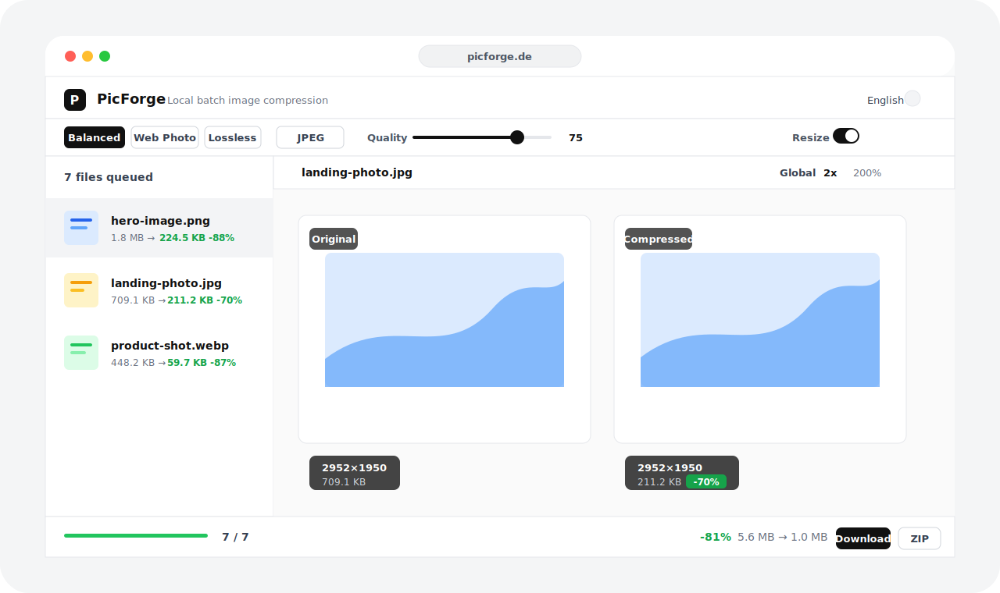

# PicForge

[](../../LICENSE)


**語言：** [English](../../README.md) | [简体中文](README.zh-CN.md) | 繁體中文 | [日本語](README.ja.md) | [한국어](README.ko.md)

**展示站點：** [picforge.de](https://picforge.de)

PicForge 是一個本機優先的瀏覽器批次圖片壓縮與尺寸調整工具。它使用 Canvas、Web Workers 和 WebAssembly 編解碼器在你的裝置上處理圖片，不需要帳號、上傳或伺服器端圖片處理。



## 功能亮點

| 功能        | 說明                                                       |
| ----------- | ---------------------------------------------------------- |
| 本機處理    | 解碼、尺寸調整、編碼、預覽和匯出都在瀏覽器內完成。         |
| 批次工作流  | 支援點擊選擇、拖放、資料夾拖放和貼上匯入。                 |
| 壓縮格式    | 透過 `@jsquash/*` 支援 MozJPEG、WebP、OxiPNG 和 AVIF。     |
| Worker 管線 | 瀏覽器端解碼/調整尺寸，WASM 編碼在受控 WorkerPool 中執行。 |
| 單圖覆蓋    | 任意圖片都可以用完整設定快照覆蓋全域設定。                 |
| 預覽模式    | 支援滑桿、雙欄和單圖對比，並提供縮放與平移。               |
| 匯出追蹤    | 單圖下載或 ZIP 匯出，並包含 `picforge-manifest.json`。     |
| PWA 支援    | 可安裝應用殼、離線快取和前台新版本提示。                   |
| 多語言      | 英語、簡體中文、繁體中文、日語和韓語。                     |

## 快速開始

需求：

- Node.js 18 或更新版本
- pnpm 8 或更新版本

```bash
git clone https://github.com/DejavuMoe/PicForge.git
cd PicForge
pnpm install
pnpm dev
```

開啟 `http://localhost:5173`。

生產建置：

```bash
pnpm build
pnpm preview
```

## 架構

```text
使用者檔案
  -> fileStore 佇列
  -> 生效設定：全域設定或單圖設定快照
  -> 使用瀏覽器 Canvas API 解碼並依需求調整尺寸
  -> WorkerPool 使用 @jsquash WASM 編碼像素
  -> 產生預覽 URL、大小統計、manifest 中繼資料和匯出動作
```

UI 是原生 React App Shell，包含高密度工作區控制項：頁首、工具列、檔案列表、預覽、單圖設定和狀態列。預覽覆蓋層與圖片變形層分離，因此縮放時標籤和中繼資料不會被放大。

## 命令

| 命令             | 作用                                        |
| ---------------- | ------------------------------------------- |
| `pnpm dev`       | 啟動開發伺服器。                            |
| `pnpm build`     | 建置生產應用。                              |
| `pnpm preview`   | 預覽生產建置。                              |
| `pnpm lint`      | 執行 ESLint。                               |
| `pnpm test`      | 執行 Vitest。                               |
| `pnpm typecheck` | 對 app、worker、codecs 三個套件做型別檢查。 |

## 文件

| 文件                                  | 用途                 |
| ------------------------------------- | -------------------- |
| [Architecture](../ARCHITECTURE.md)    | 執行時架構與資料流。 |
| [Roadmap](../ROADMAP.md)              | 產品和工程規劃。     |
| [QA checklist](../QA_CHECKLIST.md)    | 手動發布檢查。       |
| [i18n guide](../I18N.md)              | 翻譯與語言支援說明。 |
| [Changelog](../CHANGELOG.md)          | 版本歷史。           |
| [Contributing](../../CONTRIBUTING.md) | 開發和 PR 指南。     |
| [Security](../../SECURITY.md)         | 漏洞回報與隱私模型。 |

## 隱私

PicForge 只在本機讀取使用者選擇的檔案，並用物件 URL 完成預覽和匯出。檔案或結果移除時會回收物件 URL。如果你自行部署，請不要在預設路徑中加入分析、上傳或遠端處理，除非使用者明確選擇加入。

## 授權

[MIT](../../LICENSE) © [DejavuMoe](https://github.com/DejavuMoe)
